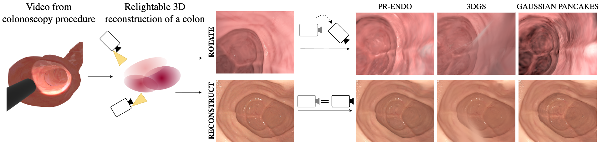

# PR-ENDO: Physically Based Relightable Gaussian Splatting for Endoscopy

[](https://arxiv.org/abs/2411.12510)  [](https://sanoscience.github.io/PR-ENDO/)

Endoscopic procedures are crucial for colorectal cancer diagnosis, and three-dimensional reconstruction of the environment for real-time novel-view synthesis can significantly enhance diagnosis. We present PR-ENDO, a framework that leverages 3D Gaussian Splatting within a physically based, relightable model tailored for the complex acquisition conditions in endoscopy, such as restricted camera rotations and strong view-dependent illumination. By exploiting the connection between the camera and light source, our approach introduces a relighting model to capture the intricate interactions between light and tissue using physically based rendering and MLP. Existing methods often produce artifacts and inconsistencies under these conditions, which PR-ENDO overcomes by incorporating a specialized diffuse MLP that utilizes light angles and normal vectors, achieving stable reconstructions even with limited training camera rotations. We benchmarked our framework using a publicly available dataset and a newly introduced dataset with wider camera rotations. Our methods demonstrated superior image quality compared to baseline approaches.





## Separate Light effects from Tissue properties
We separate light effects from tissue properties, adjust light direction and spotlight angle for realistic relightning effects.


<p align="center">
  
  
  
</p>


## Simulate Body Movements
We simulate body movements using GaMeS reparameterization.

<p align="center">
  
  
  
</p>

## Installation Steps

### Prerequisites
Ensure you have the following installed:
- Miniconda or Anaconda
- NVIDIA GPU with CUDA 12.1 support
- Python 3.10

#### 1. Create and Activate a Conda Environment
```
conda create -n prendo python=3.10 -y
conda activate prendo
```

#### 2. Install PyTorch and CUDA Dependencies
```
conda install pytorch==2.1.0 torchvision==0.16.0 torchaudio==2.1.0 pytorch-cuda=12.1 -c pytorch -c nvidia
```
#### 3. Install Required Python Packages
```
pip install tqdm lpips plyfile matplotlib natsort pytorch_ssim pytorch_msssim imageio[ffmpeg] openexr
```
#### 4. Install Submodules
```
pip install submodules/depth-diff-gaussian-rasterization/
pip install submodules/simple-knn/
pip install submodules/gaussian-norms/
```
#### 5. Install FAISS GPU
```
pip install https://github.com/kyamagu/faiss-wheels/releases/download/v1.7.3/faiss_gpu-1.7.3-cp310-cp310-manylinux_2_17_x86_64.manylinux2014_x86_64.whl
```
#### 6. Install Tiny-CUDA-NN
```
pip install git+https://github.com/NVlabs/tiny-cuda-nn/#subdirectory=bindings/torch
```

## Training

To train the model, follow these steps:

1. **Prepare the Data**\
   Before running the training, you must process the data using EndoGSLAM. The dataset should be structured correctly, with scenes organized under the `C3VD/...` and `C3VD_endogslam_optimized/...` directory. Data used for trainig available [here](https://sanoscience-my.sharepoint.com/:f:/g/personal/j_kaleta_sanoscience_org/EvkA8HMXxiBEpeKpsDcb2L4B-C1DfEUdCzDzSPeOVnirnA?e=QYLQjU).
2. **Update the Data Path**\
   Before executing the training script, ensure you set the correct data path in `run_all.sh`. Locate the following line:
   ```bash
   base_path=""
   ```
   and update it with the appropriate dataset path to `C3VD` folder (`C3VD_endogslam_optimized` should be found automatically).

3. **Run Training**\
   Once the data is prepared, start the training process by executing the script:
   ```bash
   ./run_all.sh
   ```
   This script will handle the full training pipeline.


Coming soon: script for light rotations.  
TODO: HG as parameter. Currently to use HG please uncomment
 l. 211 in `scene/gaussian_model.py` and `l.107 in scene/mlp.py`

## Citation
If you find this work useful, please cite:

```bibtex
@misc{kaleta2024prendo,
      title={PR-ENDO: Physically Based Relightable Gaussian Splatting for Endoscopy}, 
      author={Joanna Kaleta and Weronika Smolak-Dyżewska and Dawid Malarz and Diego Dall'Alba and Przemysław Korzeniowski and Przemysław Spurek},
      year={2024},
      eprint={2411.12510},
      archivePrefix={arXiv},
      primaryClass={cs.CV},
      url={https://arxiv.org/abs/2411.12510}
}
```


