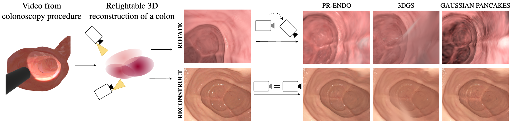

## PR-ENDO: Physically Based Relightable Gaussian Splatting for Endoscopy

Endoscopic procedures are crucial for colorectal cancer diagnosis, and three-dimensional reconstruction of the environment for real-time novel-view synthesis can significantly enhance diagnosis. We present PR-ENDO, a framework that leverages 3D Gaussian Splatting within a physically based, relightable model tailored for the complex acquisition conditions in endoscopy, such as restricted camera rotations and strong view-dependent illumination. By exploiting the connection between the camera and light source, our approach introduces a relighting model to capture the intricate interactions between light and tissue using physically based rendering and MLP. Existing methods often produce artifacts and inconsistencies under these conditions, which PR-ENDO overcomes by incorporating a specialized diffuse MLP that utilizes light angles and normal vectors, achieving stable reconstructions even with limited training camera rotations. We benchmarked our framework using a publicly available dataset and a newly introduced dataset with wider camera rotations. Our methods demonstrated superior image quality compared to baseline approaches.




## Citation
If you find this work useful, please cite:

```bibtex
@misc{kaleta2024prendo,
      title={PR-ENDO: Physically Based Relightable Gaussian Splatting for Endoscopy}, 
      author={Joanna Kaleta and Weronika Smolak-Dyżewska and Dawid Malarz and Diego Dall'Alba and Przemysław Korzeniowski and Przemysław Spurek},
      year={2024},
      eprint={2411.12510},
      archivePrefix={arXiv},
      primaryClass={cs.CV},
      url={https://arxiv.org/abs/2411.12510}
}
```
